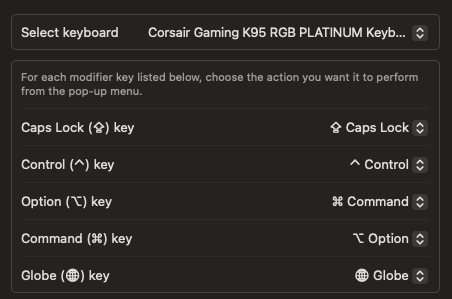

# dotfiles
Personal settings files

### Steps
- [ ] [Generate new ssh key](https://docs.github.com/en/authentication/connecting-to-github-with-ssh/generating-a-new-ssh-key-and-adding-it-to-the-ssh-agent)
- [ ] [Add new ssh key to GitHub](https://docs.github.com/en/authentication/connecting-to-github-with-ssh/adding-a-new-ssh-key-to-your-github-account)
- [ ] Install xcode: `xcode-select --install`
- [ ] Clone `dotfiles` repo: `git clone git@github.com:LaurEars/dotfiles.git`
- [ ] Run `./setup.sh` from current directory

### iTerm2 setup
The setup script installs a Dynamic Profile with badge text, SmartSelection patterns, and disables [clicking to select commands](https://superuser.com/questions/1848258/how-to-disable-selection-highlighting-on-iterm2).
- [ ] In iTerm2 > Settings > Profiles, set "Dotfiles" as the default profile

### Mac keyboard setup
To configure a standard keyboard with the function key order matching the macOS defaults:

Go to Settings > Keyboard > Keyboard Shortcuts > Modifier Keys and select the keyboard to remap

